# LimboRadio

DIY WEB RADIO playing music whenever you walk by or turn on the lights. Custom case, software, webinterface and PCB. Based on a RaspberryPi Zero W. I made it because there's simply no such thing to buy out there in the whole wide world ... and because I can ;)

Here's the complete guide from zero to hero. Take it as an inspiration, customize it your way or clone it 1:1. I decided to build 5 units: One for the kitchen, one for the bathroom and some for friends ... and because parts like case and PCB are way cheaper in bunches.

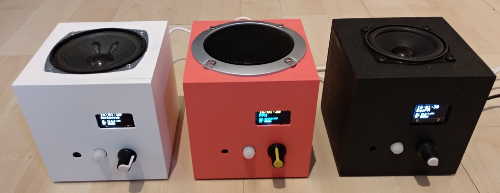

## Hardware

My build is based on a custom PCB placed in a selfmade wooden case. The base idea behind it is to have a PCB mounted on the backside of the front panel. All components are soldered so i don't need to mount and wire every single sensor manually somewhere in the case. I'm way to lazy to describe how i made the case since it's basically a simple cube with some holes in it. All the electronic parts are listed below and the images should be enough to get how things come together. Feel free to wire things yourself instead of using the PCB or place things in another (old) case instead.

#### PCB

Here's the PCB without components and how it looks like with all components soldered.

<a href="doc/pcb_blank_front.jpg">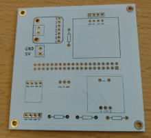</a>
<a href="doc/pcb_blank_back.jpg">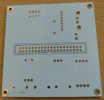</a>
<a href="doc/pcb_soldered_front.jpg">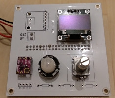</a>
<a href="doc/pcb_soldered_back.jpg">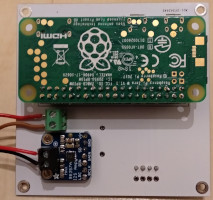</a>

#### Case

The case is basically a wooden cube with some holes for the speaker, power connector, sensors, display and rotary button.
The most interesting part is the front panel which is mounted with some small neodym magnets for easy hardware access without any screws. On it's backside you see some additional cut-outs and another wooden panel so the PCB fits perfectly.


<a href="doc/panel_front.jpg">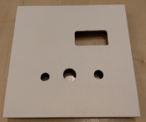</a>
<a href="doc/panel_back.jpg">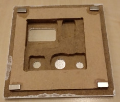</a>
<a href="doc/panel_mount.jpg">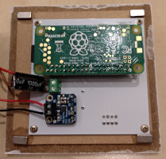</a>
<a href="doc/case_back.jpg">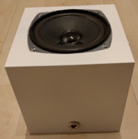</a>
<a href="doc/case_open_1.jpg">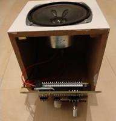</a>
<a href="doc/case_open_2.jpg">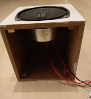</a>
<a href="doc/case_open_3.jpg">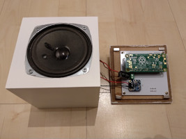</a>
<a href="doc/case_front_1.jpg">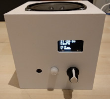</a>
<a href="doc/case_front_2.jpg">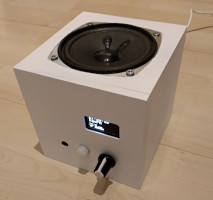</a>


#### Parts
| What                         | Specific part/model           | Price | Link |
| ---------------------------- | ----------------------------- | -----:| ---- |
| PCB                          | Gerber files in "pcb" folder  |    5€ | [AllPCB](https://www.allpcb.com) |
| Controller                   | Raspberry Pi Zero W           |   12€ | [RaspberryPi.org](https://www.raspberrypi.org/products/raspberry-pi-zero-w/)
| I2S Amplifier                | Adafruit 3W Class D MAX98357A |    7€ | [Adafruit](https://www.adafruit.com/product/3006)
| Sensor Light                 | GY-49 MAX44009                | 1.50€ | [AliExpress](https://aliexpress.com/wholesale?SearchText=gy-49+max44009)
| Sensor Movement              | SR602 Mini PIR                |    2€ | [AliExpress](https://aliexpress.com/wholesale?SearchText=SR602)
| Display                      | 0.96'' OLED I2C               |    2€ | [AliExpress](https://aliexpress.com/wholesale?SearchText=oled+i2c+128x64)
| Knob (Volume/Channel Switch) | EC11 Rotary Button Encoder    | 0.50€ | [AliExpress](https://aliexpress.com/wholesale?SearchText=ec11)
| Power Connector              | DC099 DC Socket (5,5x2,1mm)   | 0.50€ | [AliExpress](https://aliexpress.com/wholesale?SearchText=dc099)
| Capacitor                    | 25V 1000uf                    | 0.20€ | [AliExpress](https://aliexpress.com/wholesale?SearchText=capacitor+25v+1000uf)
| Speaker                      | Choose whatever you like      |    5€ | [AliExpress](https://aliexpress.com/wholesale?SearchText=audio+speaker+full+range+3w)
| Case                         | Build yourself!               |   10€ | [ExpressZuschnitt](https://expresszuschnitt.de/)
| The usual stuff              | Cables, solder, screws, ...   |    5€ | --- |
|                              |                               |  **~50€** | **SUM** |


## Software

The core software is written in C with an Angular Webinterface. The setup guide is based on my favorite distro: ArchLinux.

Setup a SD card using the [official arch guide](https://archlinuxarm.org/platforms/armv6/raspberry-pi#installation) for RaspberryPi Zero W. But it in your Pi and follow the guide:

```
# Ssh to your raspberry (alarm/alarm , root/root)
ssh alarm@PI_IP
su

# Finish arch setup
pacman-key --init
pacman-key --populate archlinuxarm

# Install required packages
pacman -Syu --noconfirm vim alsa-utils wiringpi i2c-tools mpd ncmpc git base-devel libwebsockets jansson wpa_supplicant cronie wget

# Set timezone
timedatectl set-timezone Europe/Berlin

# Configure custom stuff. I prefer to allow root ssh login and delete user "alarm" because I hate su/sudo overhead:
vim /etc/ssh/sshd_config
PermitRootLogin yes
userdel -f alarm

# Get LimboRadio
cd /opt
git clone https://github.com/thomaskuh/limboradio
cd limboradio

# Configure Hardware/IO/Pi/System/OS
make setup

# Build LimboRadio
make

# Install LimboRadio (Install binaries, systemd autostart)
make install

# Done. Now reboot to kick everything off.
reboot
```

The above should be quite common for those of you having some basic linux/arch skills. The only step that requires some explanation is ```make setup```. This one-liner is sets up hardware interfaces and OS services so LimboRadio could work smoothly. If you're interested in details, just take a look at the Makefile. Basically it does the following:
- Setup I2S and I2C busses (via /boot/config.txt and kernel modules)
- Setup linux sound system (alsa, i2s amp)
- Setup MPD autostart
- Setup Wifi with profile based auto-re-connect using netctl.


### WiFi configuration
To allow changes in wifi configuration without cable-connect, LimboRadio comes with the following setup:
- With "make setup" you already configured netctl for profile based wifi auto-re-connect.
- There's a fallback profile trying to connect to a wifi hotspot with SSID "yeah" and password "yeahyeah".
- There's another profile that could be configured via LimboRadio WebUI by opening http://[IP shown in display] in your browser.

So if you're still cable-connected: Simply enter the URL. Otherwise create an access point with the credentials mentioned above an you'll see LimboRadio connecting in a minute.


### Useful tools for development and troubleshooting

Alsa
```
# List audio playback devices
aplay -l

# Test playback
speaker-test -c2
speaker-test -c2 --test=wav -w /usr/share/sounds/alsa/Front_Center.wav
```

MPD
```
# ncurses based client for MPD control and testing
ncmpc
```

GPIO / I2C
```
# Read all GPIO pin states
gpio readall

# Display should be on bus 0 address 0x4a
i2cdetect -y 0

# Lux sensor should be on bus 1 address 0x3c
i2cdetect -y 1

```


### PCB design flaws / ToDos for future versions
* 3 resistors at the bottom are not required. Internal Pi pull-ups are doing just fine.
* We could remove some mm at the bottom cause it collides with ethernet port when working on a full sized Pi (instead of the zero).
* Display mount holes are a bit to small.
* Prototyping with a full sized Pi worked pretty well but after switching to the Pi zero voltage seems to break down on high volume/baselines, maybe due to no/lower capacitory on the pi zero. As a workaround I put an additional capacitor into my power screw block but there really should be dedicated place on the PCB.
